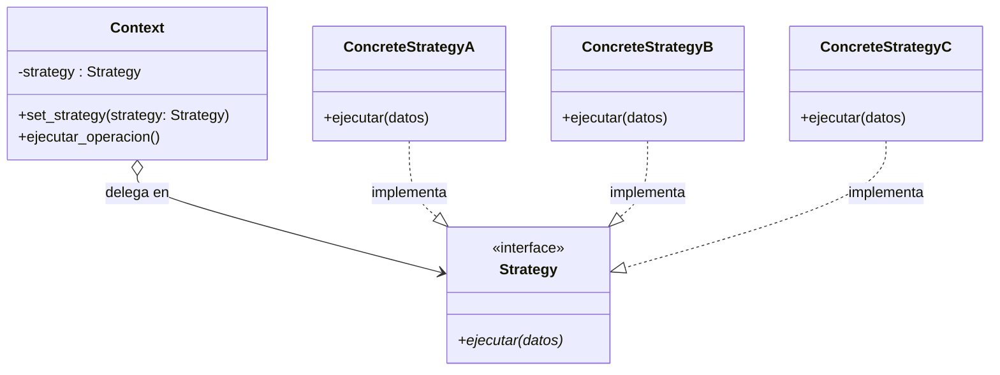
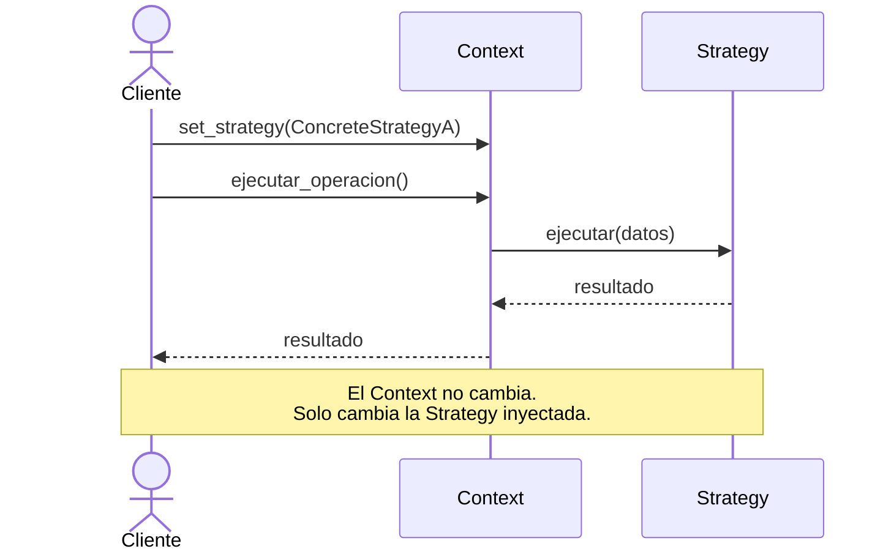
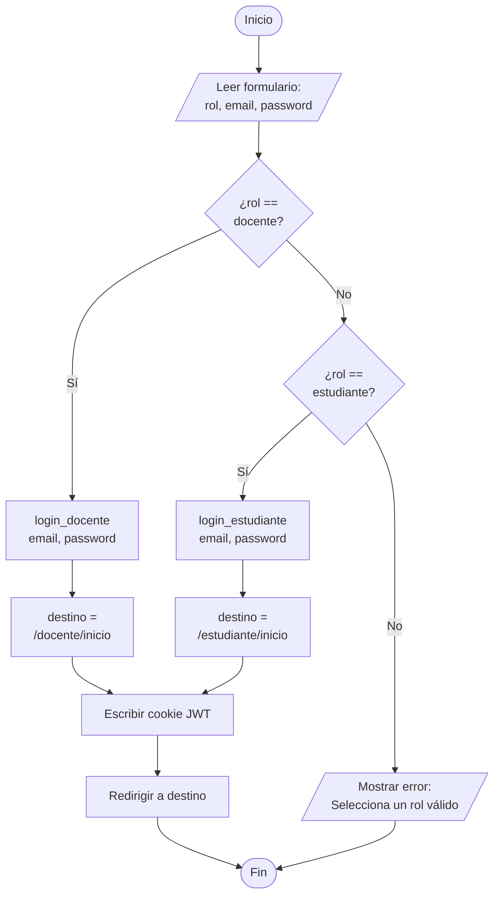
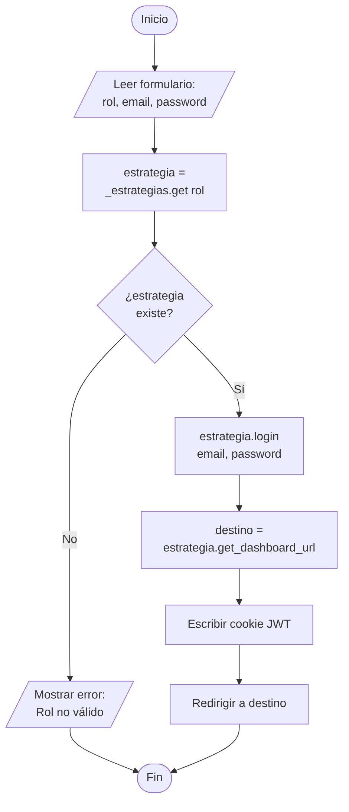
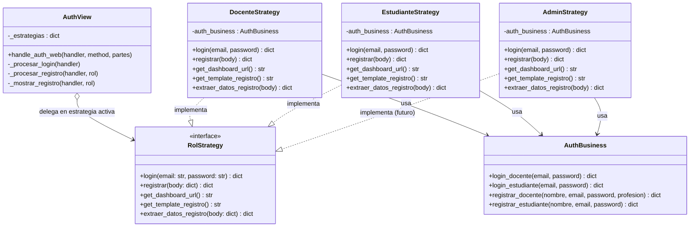
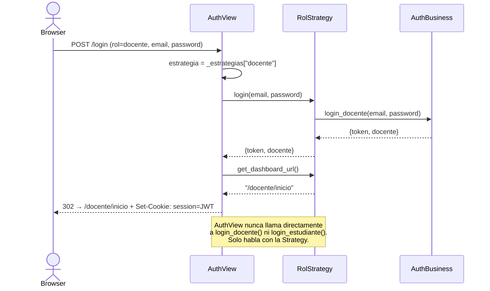
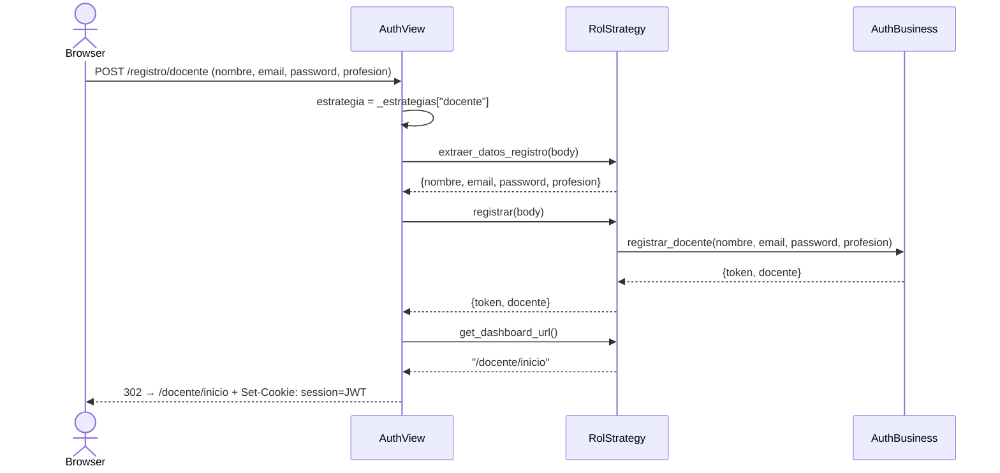
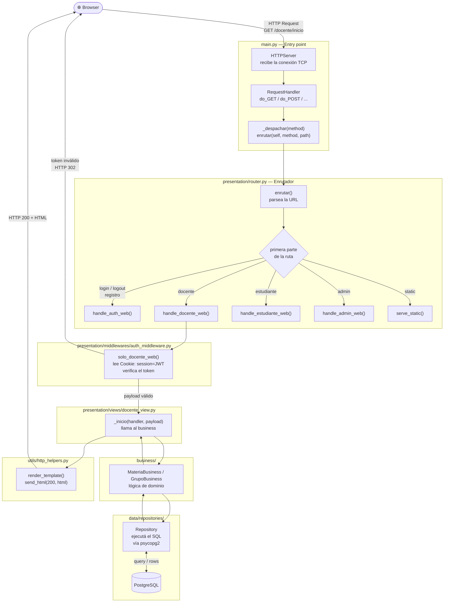
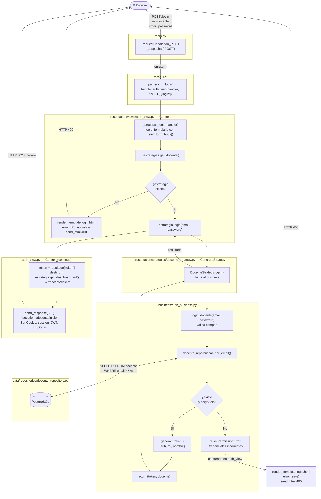

# Patrón de Diseño: Estrategia (Strategy)

## 1. Teoría del patrón

### Definición

El patrón **Estrategia** es un patrón de comportamiento que permite definir una familia de algoritmos,
encapsular cada uno en una clase separada y hacer que sus objetos sean intercambiables en tiempo de
ejecución, sin que el código que los usa necesite conocer cuál está activo.

> "Define una familia de algoritmos, encapsula cada uno y los hace intercambiables.
> Strategy permite que el algoritmo varíe independientemente de los clientes que lo usan."
> — Gang of Four (GoF)

---

### El problema que resuelve

Sin el patrón, cuando un comportamiento varía según un tipo o condición, el código crece mediante
bloques `if/elif` que se repiten en múltiples lugares. Cada vez que se agrega una variante nueva,
hay que encontrar y modificar todos esos bloques, violando el principio **Open/Closed**
(abierto para extensión, cerrado para modificación).

```python
# Sin Strategy — el problema
def procesar(tipo):
    if tipo == "A":
        # algoritmo A
    elif tipo == "B":
        # algoritmo B
    elif tipo == "C":   # cada nueva variante obliga a modificar este bloque
        # algoritmo C
```

---

### Componentes

| Componente | Rol |
|---|---|
| **Strategy** | Interfaz o clase base que declara el método común a todos los algoritmos |
| **ConcreteStrategy** | Implementación concreta de una variante del algoritmo |
| **Context** | Objeto que usa una Strategy. Delega el trabajo sin conocer la implementación |

---

### Diagrama de clases general



---

### Diagrama de secuencia general



---

### Cuándo aplicarlo

- Cuando existen múltiples variantes de un mismo comportamiento que comparten la misma firma.
- Cuando una clase tiene un bloque `if/elif` que crece cada vez que se agrega una variante.
- Cuando se quiere poder agregar variantes nuevas sin modificar el código existente.
- Cuando el algoritmo debe poder cambiarse en tiempo de ejecución o en tiempo de configuración.

---

### Ventajas y desventajas

| Ventajas | Desventajas |
|---|---|
| Cumple Open/Closed: agregar variante = agregar clase | Agrega más clases al proyecto |
| Elimina bloques `if/elif` en el Context | El cliente debe conocer las estrategias disponibles |
| Cada algoritmo vive aislado y es testeable por separado | Puede ser excesivo si solo hay dos variantes simples |
| El Context y las Strategies evolucionan independientemente | |

---

## 2. Aplicación en este proyecto — Caso de uso 2: Autenticación por rol

### El problema actual

En `presentation/views/auth_view.py` el comportamiento varía por rol del usuario
en **tres funciones distintas** con el mismo `if/elif`:

```python
# _procesar_login
if rol == "docente":
    resultado = auth_business.login_docente(email, password)
    destino = "/docente/inicio"
elif rol == "estudiante":
    resultado = auth_business.login_estudiante(email, password)
    destino = "/estudiante/inicio"

# _procesar_registro_docente  →  lógica exclusiva de docente
# _procesar_registro_estudiante  →  lógica exclusiva de estudiante
```

Lo que varía por rol es exactamente la misma familia de decisiones:

| Decisión | Docente | Estudiante |
|---|---|---|
| Método de login | `login_docente()` | `login_estudiante()` |
| Método de registro | `registrar_docente()` | `registrar_estudiante()` |
| Dashboard de destino | `/docente/inicio` | `/estudiante/inicio` |
| Template de registro | `registro_docente.html` | `registro_estudiante.html` |
| Campos del formulario | nombre, email, password, profesión | nombre, email, password |

Agregar un rol nuevo (Administrador, Coordinador) obliga a tocar `auth_view.py`
en varios puntos, arriesgando romper el flujo de los roles existentes.

---

### Diagrama de diseño procedimental — Estado actual (el problema)

Flujo interno de `_procesar_login` tal como existe hoy. Cada rol agrega un nuevo
rombo de decisión y una nueva rama, haciendo el procedimiento más difícil de mantener
con cada rol que se incorpore.



> Agregar un rol **Admin** signi fica añadir otro rombo debajo de `¿rol == estudiante?`,
> modificando un procedimiento que ya funciona y arriesgando romper los roles existentes.

---

### Diagrama de diseño procedimental — Con Strategy (la solución)

Con el patrón aplicado, `_procesar_login` deja de tomar decisiones sobre roles.
Solo busca la estrategia en un diccionario y le delega el trabajo. El procedimiento
no cambia aunque se agreguen diez roles nuevos.



> Agregar un rol **Admin** significa crear `AdminStrategy` y registrarla en el diccionario.
> Este procedimiento no se toca.

---

### Solución con Strategy

Cada rol se convierte en una **ConcreteStrategy** que encapsula todas sus decisiones.
`auth_view.py` pasa a ser el **Context**: recibe el rol como string, busca la estrategia
correspondiente en un diccionario y le delega todo el trabajo.

Agregar un rol nuevo = agregar una clase nueva + registrarla en el diccionario.
El resto del código no cambia.

---

### Diagrama de clases — Implementación específica



---

### Diagrama de secuencia — Flujo de login web



---

### Diagrama de secuencia — Flujo de registro web



---

### Ubicación de los archivos en el proyecto

```
presentation/
├── strategies/                       ← NUEVA carpeta
│   ├── __init__.py
│   ├── rol_strategy.py               ← interfaz base (RolStrategy)
│   ├── docente_strategy.py           ← DocenteStrategy
│   └── estudiante_strategy.py        ← EstudianteStrategy
├── views/
│   └── auth_view.py                  ← Context (se simplifica)
└── ...
```

---

### Extensibilidad — agregar un rol nuevo

Para agregar un rol **Administrador** con su propio portal `/admin/panel`:

1. Crear `presentation/strategies/admin_strategy.py` con clase `AdminStrategy`.
2. Registrarla en el diccionario de `auth_view.py`:

```python
_estrategias = {
    "docente":     DocenteStrategy(),
    "estudiante":  EstudianteStrategy(),
    "admin":       AdminStrategy(),   # ← única línea que cambia en AuthView
}
```

3. Crear la vista `presentation/views/admin_view.py`.
4. Agregar la ruta en `presentation/router.py`.

**Ninguna estrategia existente se toca.** El principio Open/Closed se cumple completamente.

---

## 3. Flujo completo de una petición HTTP

### Flujo general — cualquier ruta

Desde que el browser envía la petición hasta que recibe la respuesta, la petición
atraviesa cuatro capas. Cada capa tiene una responsabilidad única y no conoce los
detalles internos de la siguiente.



---

### Flujo específico — POST /login con el patrón Strategy

Este flujo muestra con detalle qué sucede cuando el usuario envía el formulario de
login. Es el recorrido que aplica el patrón Estrategia.



---

### Resumen por capa

| Capa | Archivo | Responsabilidad |
|---|---|---|
| **Entry point** | `main.py` | Recibe la conexión TCP, crea el handler, llama al router |
| **Router** | `presentation/router.py` | Parsea la URL y despacha al view correcto |
| **Middleware** | `auth_middleware.py` | Verifica el JWT de la cookie antes de permitir el acceso |
| **View / Context** | `presentation/views/*.py` | Lee el formulario, delega en la Strategy, construye la respuesta |
| **Strategy** | `presentation/strategies/*.py` | Encapsula las decisiones específicas de cada rol |
| **Business** | `business/*.py` | Valida reglas de dominio, hashea passwords, genera tokens |
| **Repository** | `data/repositories/*.py` | Ejecuta el SQL y mapea las filas a diccionarios |
| **DB** | PostgreSQL | Persiste y consulta los datos |
| **Helpers** | `utils/http_helpers.py` | Renderiza templates Jinja2 y escribe la respuesta HTTP |
